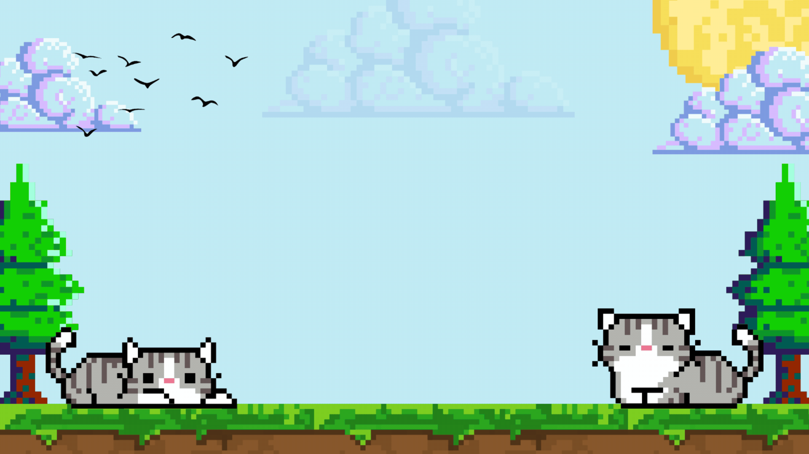

  

 

  <h3>Olá, eu sou o Gabriel Passos 👋</h3>
  
<em>Bem-vindo ao meu mundo onde tecnologia e criatividade se encontram</em>

### Atividade
Atualmente tenho me dedicado a projetos nas áreas de:
- **IoT e Sistemas Embarcados**: focado em aplicações eficientes usando ESP32, C e redes móveis.
- **Visão Computacional e C em dispositivos embarcados**: análise de imagens para detecção de enchentes em tempo real.
- **Redes Móveis (4G/5G)**: testbeds com OpenAirInterface, gnbsim e núcleo de rede.

---

### Tecnologias & Ferramentas

  

    
    
    
    
    
    
    
    
  

---

### Estatísticas do GitHub

  
  

---

### Formação Acadêmica

  

    <strong>Bacharelando em Ciência da Computação</strong>
     
    <i>Universidade Estadual Paulista (UNESP)</i>
     
    <i>Previsão de conclusão: Dezembro de 2025</i>
  

---

### Vamos Conversar?

  

    
    
    
  

  

    <em>Aberto para colaborações, pesquisa, projetos open source ou apenas uma boa conversa sobre tecnologia!</em>
  

 

